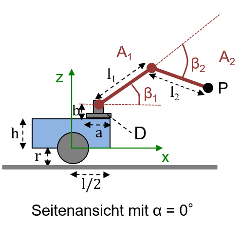

# 2. Greifarmkinematik

## 2.1 Vorwärtskinematik
| $`x_R`$ | $`y_R`$ | $`\theta`$ | $`l`$ | $`h`$ | $`r`$ | $`a`$ | $`b`$ | $`\alpha`$ | $`l_1`$ | $`\beta_1`$ | $`l_2`$ | $`\beta_2`$ |
|---------|---------|------------|-------|-------|-------|-------|-------|------------|---------|-------------|---------|-------------|
| 2       | 1       | 30°        | 0.6   | 0.2   | 0.1   | 0.1   | 0.1   | 40°        | 0.5     | 30°         | 0.5     | -10°        |

Die Tabelle legt die Parameter des mobilen Greifarmroboters aus Aufgabe 2.4 aus der Vorlesung fest.
Geben Sie den Punkt $`P^O`$ der Armspitze von $`A_2`$ im globalen KS $`O`$ an.
Überprüfen sie ihr Ergebnis mit $`P^{A2} = (0,0,0,1)`$.
Der resultierende Punkt sollte sich bei $`P^O = (2.525,1.973,0.821,1.000)`$ befinden.

    
    

## 2.2 Inverse Kinematik
Gegeben ist die Position $`P^R`$ der Armspitze von $`A_2`$ im Roboter-KS $`R`$. 
Leiten Sie durch algebraische oder geometrische Überlegungen die inverse Kinematik her. 
Berücksichtigen Sie dabei die Lösung der Aufgabe 2.5 aus der Vorlesung. 
Sehen Sie Elbow-Up voraus (wie in der Zeichnung), um eine eindeutige Lösung zu erhalten. 
Schreiben Sie eine Funktion, die aus $`P^R`$ die drei Gelenk-Drehwinkel $`\alpha`$, $`\beta_1`$ und $`\beta_2`$ berechnet. 
Überprüfen Sie Ihr Ergebnis durch Anwendung der Vorwärtskinematik.
Vernachlässigen Sie eventuelle Kollisionen mit dem Roboter.

Werfen Sie einen `ValueError`, wenn ein Punkt nicht durch den Roboter erreicht werden kann.

## 2.3 Kartesische Bewegung
Definieren Sie im Roboter-KS $`R`$ eine vertikale Tafel und schreiben Sie eine Funktion, 
die mithilfe der inversen Kinematik aus Aufgabe 2.2 eine Bewegung des Greifarms so durchführt, 
dass die Armspitze von Arm $`A_2`$ auf der Tafel einen Kreis beschreibt. 
Überprüfen Sie Ihr Ergebnis durch Anwendung der Vorwärtskinematik. 
Plotten Sie die Gelenkwinkel $`\alpha`$, $`\beta_1`$ und $`\beta_2`$ mit Hilfe des Python-Pakets matplotlib. 
Sichern Sie Ihren Plot unter dem Namen `gelenkwinkel.png` im Verzeichnis `task2`. 
Überprüfen sie Ergebnisse in dem sie einen Kreis mit einem Radius von 0.25m um den Mittelpunkt $`KM^R = (1.000,0.000,0.550,1.000)`$ im Roboterkoordinatensystem $`R`$ zeichnen. 
Die Winkelverläufe sollten dann wie folgt aussehen:

<figure style="text-align: center">
    
    <figcaption>Winkelverläufe für Kreis mit Radius 0.25m  in
einem Abstand von 1.0m im Roboter-KS R.</figcaption>
</figure>

Plotten Sie außerdem den gezeichneten Kreis in der Draufsicht und speichern Sie den Plot unter dem Namen `kreis.png` im Verzeichnis `task2`.

Verwenden Sie zum Generieren der Winkel für die Kreisbewegung ``np.linspace`` im Bereich von $`0`$ bis $`2 \pi`$.

## Abgabe
Bearbeiten Sie die Aufgabe mit ihrem Team auf Ihrem Fork in Branch `task2`. 
Sobald Sie fertig sind, stellen Sie einen Merge Request gegen den Branch `master` im Abgabe-Repository.
Die Abgabe gilt als bestanden, wenn die CI-Tests ohne Fehler durchlaufen und der Merge-Request akzeptiert wurde. 

## Deadline
Der Merge-Request muss bis zum 15. November 2022 um 23:59 erstellt worden sein.